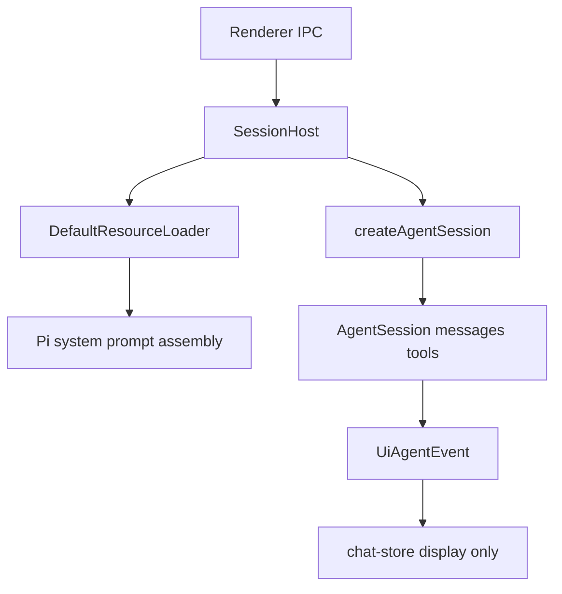

# Agent 上下文说明

本文说明 X-agent 里 **模型实际看到的上下文** 如何组织与生效。受众：维护本仓库的开发者、排查「模型到底知道什么」的人。

相关文档：[`CLAUDE.md`](CLAUDE.md)（项目指引）、[`Pi插件指导文档.md`](Pi插件指导文档.md)（插件类型）、[Pi SDK](https://pi.dev/docs/latest/sdk)。

---

## 核心结论

X-agent **不手写 LLM context**。真正组装发生在 `@earendil-works/pi-coding-agent` 的 `DefaultResourceLoader` + `createAgentSession`（内部 `buildSystemPrompt`、会话消息、compaction）。

本应用只做：

- 选定项目 `cwd`、全局 `agentDir`（`~/.pi/agent`）
- 传入工具白名单、model、thinking、Godot `customTools`
- 会话落盘到隔离目录 `~/.pi/agent/x-agent/sessions/`（与 Pi CLI 的 `sessions/` 分开）
- **不**使用 `systemPromptOverride`

主接线点：[`apps/desktop/electron/agent/session-host.ts`](apps/desktop/electron/agent/session-host.ts) 的 `createSession`。

UI 侧的 `history` / `truncate` / `chat-store` **只用于展示**，不是第二套 context builder。

---

## 总览数据流



1. Renderer 经 IPC 打开项目 / 发 prompt / 改 prefs。
2. `main.ts` 将请求交给单个 `SessionHost`。
3. `SessionHost.createSession` 创建 `DefaultResourceLoader({ cwd, agentDir })`，`reload()` 后交给 `createAgentSession`。
4. Pi 组装 system prompt、启用工具、恢复/创建会话消息；后续 `prompt` 写入同一 `AgentSession`。
5. 事件经 `agent:event` 推到 renderer；`applyAgentEvent` 归并展示。

---

## 模型实际看到的上下文分层

以下顺序对应 Pi 侧 system / 消息组装（X-agent 未覆盖这些钩子时的默认行为）。

### 1. System 基座

- 默认：Pi coding-assistant 系统提示（工具说明、通用准则等）
- 或替换：存在 `SYSTEM.md` 时用之；**项目** `.pi/SYSTEM.md` 优先于 **全局** `~/.pi/agent/SYSTEM.md`

### 2. Append

- `APPEND_SYSTEM.md`（项目与全局，有则追加）

### 3. `<project_context>`

- 发现 `AGENTS.md` / `CLAUDE.md`（及大小写变体）
- 全局：`~/.pi/agent/AGENTS.md`（或 CLAUDE）
- 再从文件系统根向 `cwd` 向上 walk；同目录优先 `AGENTS.md`
- **全文**进入 system（不是索引）

### 4. `<available_skills>`

- 已发现技能的 **名称 / 描述 / 路径** 索引
- 完整 `SKILL.md` **不**预装；模型需要时用 `read`（或 slash skill）按需加载
- 若 `read` 未在工具白名单中，技能索引可能被省略（Pi 行为）

### 5. CWD 与工具面

- 一行当前工作目录
- 已启用工具的名称与描述；Godot 等 `customTools` 的 `promptSnippet` / `promptGuidelines` 进入工具说明
- Extension 注册的工具同样受白名单约束

### 6. 会话消息（对话上下文）

- 持久化在 `SessionManager` 管理的会话文件（根：`~/.pi/agent/x-agent/sessions/`）
- 恢复会话 = 恢复同一消息历史给模型
- 超窗时由 **Pi 自动 compaction**（摘要 + 保留窗口）；X-agent **未**暴露 compact UI，也 **未**调用 `session.compact()`

### 7. 按需写入（非 system 预装）

运行中工具结果、仓库文件内容、技能正文等进入后续 messages，不在会话创建时全部塞进 system。

### Prompt 模板 vs 上下文

| 类型 | 是否自动进 system | 说明 |
|---|---|---|
| Skill | 仅元数据索引 | 正文 on-demand |
| Prompt 模板（`.pi/prompts/`） | 否 | 用户调用 `/name` 时展开为用户消息 |
| Extension | 间接 | 工具、命令、事件钩子（可改 system / 发消息） |
| Theme | 否 | 仅 UI |

资源发现根：

- 项目：`cwd/.pi/{skills,extensions,prompts,themes}/`、向上的 `.agents/skills/`、`AGENTS.md`/`CLAUDE.md`、`.pi/SYSTEM.md` 等
- 全局：`~/.pi/agent/` 下同类目录与文件
- Packages：经 `pi install` 落入 Pi 安装布局后由 loader 发现

---

## X-agent 显式传入的会话参数

`createSession` 中（概念对照）：

```ts
const loader = new DefaultResourceLoader({ cwd, agentDir });
await loader.reload();

await createAgentSession({
  cwd,
  agentDir,
  resourceLoader: loader,
  modelRuntime,
  sessionManager,
  tools: prefs.tools,
  customTools: godotRpc ? createGodotTools(godotRpc) : [],
  model: selectedModel,
  thinkingLevel: prefs.thinkingLevel,
});
```

| 参数 | 来源 | 作用 |
|---|---|---|
| `cwd` | 打开的项目路径 | 工具 FS 根；项目资源发现 |
| `agentDir` | Pi `getAgentDir()` → 通常 `~/.pi/agent` | 全局资源 / settings |
| `resourceLoader` | `DefaultResourceLoader` + `reload()` | skills / extensions / prompts / themes / context files |
| `tools` | `~/.pi/agent/x-agent.json` 的 `tools` | 工具白名单 |
| `customTools` | [`godot-tools.ts`](apps/desktop/electron/agent/godot-tools.ts) | Godot RPC 工具定义（是否可调用仍看白名单） |
| `model` / `thinkingLevel` | prefs + `ModelRuntime`（auth / models） | 选用模型与推理级别 |
| `sessionManager` | `create` / `continueRecent` / `open`，根在 `x-agent/sessions/` | 对话持久化与恢复 |

**本应用未传入 / 未定制**：`systemPromptOverride`、`skillsOverride`、`promptsOverride`、`agentsFilesOverride`、`extensionFactories`、`SettingsManager`、`noTools` / `excludeTools` 等。更深行为以 Pi SDK 为准。

偏好文件：[`prefs.ts`](apps/desktop/electron/agent/prefs.ts) ↔ `~/.pi/agent/x-agent.json`。与上下文相关的字段：

| Pref | 是否进入模型上下文 |
|---|---|
| `provider` / `model` | 是（选用哪个模型） |
| `thinkingLevel` | 是 |
| `tools` | 是（可用工具集） |
| `showThinking` | 否（仅 UI） |
| `theme` | 否 |
| `lastProjectPath` / `lastSessionPath` | 否（启动恢复；由当前 `SessionHost` 写回） |
| `godotEditorPath` | 否（启编辑器用） |

---

## 插件与 Packages 如何进入上下文

- [`plugin-host.ts`](apps/desktop/electron/agent/plugin-host.ts)：在全局 `~/.pi/agent/{prompts,skills,extensions,themes}` 与项目 `cwd/.pi/...` 做 CRUD；写入的是 **Pi 会扫描的文件树**，不是另一套注入 API。
- 插件变更后：IPC → `SessionHost.reloadResources()` → `session.reload()`。
- [`package-manager.ts`](apps/desktop/electron/agent/package-manager.ts)：封装 `pi install` / `pi uninstall`，并在 `x-agent-packages.json` 记账；**真正加载**仍是 Pi loader。
- 类型语义见上表；主题不进 LLM。细节见 [`Pi插件指导文档.md`](Pi插件指导文档.md)。

---

## 工具与 Godot 贡献面

### 内置工具

[`shared/ipc.ts`](apps/desktop/shared/ipc.ts) 的 `AVAILABLE_TOOLS`：`read`、`bash`、`edit`、`write`、`grep`、`find`、`ls`。默认 prefs 全部开启。

### Godot（两条通道）

1. **桌面 `customTools`**（[`godot-tools.ts`](apps/desktop/electron/agent/godot-tools.ts)）  
   - 桥接存在时 **注册**；prefs 勾选对应名后才 **active**（`GODOT_TOOLS`，默认不在白名单）。  
   - `promptSnippet` / `promptGuidelines` 进入工具说明，引导模型何时调用。

2. **godot-pi Package**  
   - 技能教领域流程与何时用 RPC；扩展可注册如 `godot_detect_project` 等工具（仍受白名单过滤）。  
   - 安装后需资源重载或新会话才会进 loader。

[`godot-rpc-bridge.ts`](apps/desktop/electron/agent/godot-rpc-bridge.ts) 由当前 `SessionHost` 使用；多编辑器客户端经 `setActiveClient` 选路（与会话无关）。

---

## 隔离边界一览

| 边界 | 说明 |
|---|---|
| Session 文件 | 仅 `~/.pi/agent/x-agent/sessions/`；恢复路径须在该根下 |
| Project cwd | 工具与项目 `.pi` / AGENTS 相对该根 |
| 全局 prefs | `x-agent.json` 一份；写 last paths / 当前模型偏好 |
| Pi auth / models | `auth.json` / `models.json`，与 CLI 共用 |
| UI transcript | 展示层；截断不影响 Pi 侧完整会话（受 Pi compaction 约束） |

---

## 运行时行为（影响下一轮上下文）

| 行为 | 位置 | 效果 |
|---|---|---|
| 空闲 `prompt(text)` | `SessionHost` | 正常用户轮次，消息进入会话历史 |
| 流式中再发 | `streamingBehavior: "steer"` | 当前工具轮次后注入转向消息（否则 Pi 会报错） |
| `setActiveToolsByName` / `applyTools` | prefs 变更 | 当场改可用工具集 |
| `setModel` / `setThinkingLevel` | 顶栏 / 设置 | 影响后续请求 |
| `session.reload()` | 插件保存后 | 重载资源 |

切换项目 / 新会话 / 恢复前会释放当前 session bundle。

---

## 排障：「模型怎么会知道 / 不知道 X？」

按层排查：

1. **项目约定** — `cwd` 向上是否有 `AGENTS.md` / `CLAUDE.md`？是否被 `SYSTEM.md` 整段替换？
2. **技能** — 是否在 `~/.pi/agent/skills`、`cwd/.pi/skills` 或已安装 package 路径？`read` 是否启用？改完是否执行了 reload？
3. **工具** — 设置 → 工具白名单是否包含该工具名？Godot 是否勾选且桥已连接？
4. **会话** — 是否续了旧会话（历史里已有错误假设）？是否误以为 UI 截断等于模型上下文被截断？
5. **Packages** — `pi install` 是否成功？`x-agent-packages.json` 只是记账，loader 失败时需查 Pi 安装目录与日志。

---

## 关键源码索引

| 路径 | 角色 |
|---|---|
| [`session-host.ts`](apps/desktop/electron/agent/session-host.ts) | 创建会话、prompt/steer、reload |
| [`plugin-host.ts`](apps/desktop/electron/agent/plugin-host.ts) | 插件 CRUD → Pi 目录 |
| [`package-manager.ts`](apps/desktop/electron/agent/package-manager.ts) | `pi install` |
| [`godot-tools.ts`](apps/desktop/electron/agent/godot-tools.ts) | Godot customTools |
| [`history.ts`](apps/desktop/electron/agent/history.ts) | Pi messages → UI（非 LLM 组装） |
| [`chat-store.ts`](apps/desktop/src/stores/chat-store.ts) | UI 事件归并 |
| [`shared/ipc.ts`](apps/desktop/shared/ipc.ts) | 工具名、prefs 类型 |
