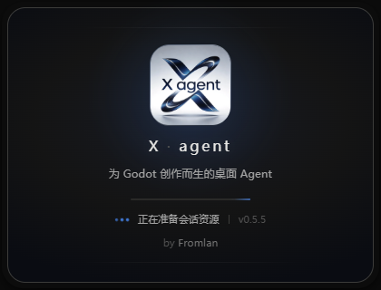

<h1 align="center">X-agent</h1>

<p align="center">
  
</p>

<p align="center">
  <strong>A desktop coding agent for Godot 4: edit code, run scenes, and rewind to any step—all in the same session.</strong>
</p>

<p align="center">
  <a href="https://github.com/Fromlan/X-agent/releases/latest"></a>
  
  <a href="LICENSE"></a>
  <a href="https://github.com/Fromlan/X-agent/stargazers"></a>
  
  
</p>

<p align="center">
  <a href="#install">Install</a> ·
  <a href="#what-is-x-agent">Three pillars</a> ·
  <a href="docs/agent.md">Dev docs</a> ·
  <a href="docs/roadmap.md">Roadmap</a> ·
  <a href="CHANGELOG.md">Changelog</a> ·
  <a href="https://github.com/Fromlan/X-agent/issues">Issues</a>
</p>

<p align="center">
  <a href="README.md">🇨🇳 简体中文</a> | <a href="README.en.md">🇺🇸 English</a>
</p>

---

> **Early Beta**: under active development; expect rough edges.

> Not AGI, but the most differentiated desktop agent in the Godot niche: editor RPC integration + Shadow Git rollback + 4 modes / 2 types hard-gated.

## Install

**Windows** (the only currently supported desktop platform):

- **Installer**: [GitHub Releases](https://github.com/Fromlan/X-agent/releases/latest) — pick `X-agent-Setup-x.y.z.exe` and double-click
- **In-app updates**: after install, launch silently checks for new versions (Settings → General, or the TopBar entry, can trigger manual checks)

**macOS / Linux**: wait for the release—see [ROADMAP §1.3](docs/roadmap.md). Developers can run from source (see "From source" below).

## 30-second start

1. Open the app and **Open project** to pick your Godot project root
2. **Authenticate**: Settings → General → "Open Pi login" (or `pi login` already signed in locally)
3. (Optional) **Bridge the Godot editor**: Settings → Godot → Editor connection → install the **X-agent RPC** addon → enable `x_agent_rpc` inside Godot
4. Type a prompt, press Enter

Going deeper: [role-based scenarios](#what-do-you-want-to-do-with-x-agent) / [settings overview](#settings) / [keyboard shortcuts](#keyboard-shortcuts).

## What is X-agent?

X-agent does three things other agents don't: **deep Godot integration**, **trustworthy rollback**, **hard mode gates**. Each pillar links to the deeper mechanism in [docs/agent.md](docs/agent.md).

### 🎮 Deep Godot integration

- **Editor RPC (TCP)** — the agent drives your running Godot editor: open / reload scenes, run current or main scene, capture play errors and stream them back. Default port `8765` (fallback `8765–8774`), with explicit multi-editor routing. See [docs/agent.md §七](docs/agent.md)
- **27 Godot tools** — scene introspection (node tree / properties / current scene / open scenes) / debugger (breakpoints / state) / resource hygiene (unused / lint / import / wait-for-import / UID resolve) / export (headless sub-process / templates / preset list) / config R/W (`project.godot`) / read-only introspection (global classes / conflict check / export templates / script inspect / project file list / editor info)
- **`godot-docs-4-7` skill** — auto-discovered by Pi and surfaced in `<available_skills>`; load the full SKILL.md on demand via `read`—**0 tokens wasted on methodology you don't need**
- **Ready checklist** — first-time setup wizard for Godot projects (auth / bash / RPC addon / Godot tools / docs)

### ↩️ Trustworthy rollback

- **Shadow Git checkpoints** (an independent checkpoint per prompt, isolated from your project's `.git`) → rewind / edit-resend / regenerate restores by diff path, **won't clobber edits you made during the turn**. Without Git, falls back to `write` / `edit` byte baselines
- **Diff preview** (0.5.3+) — every turn shows `+/-`-colored diffs below the reply (with file count and `+N` / `-N` stats); the rewind confirmation dialog also shows a "what will be restored" diff so you can verify line-by-line
- **Resumes survive restarts**: Shadow state persists across session restore

### 🔀 4 modes + 2 types, hard-gated

- **Session modes (mutually exclusive)**:
  - **Agent** — normal coding (default allowlist)
  - **Ask / Research** — read-only Q&A; hard-closes `write` / `edit` / `write_plan`; `bash` only allows read-only commands and paths must stay inside the project cwd
  - **Plan** — read-only research + `write_plan`; editable plan in the right panel, save to project, **Build plan** switches back to Agent to implement
  - **Goal** — set a completion condition; independent evaluator auto-continues while unmet (turn + token double budget)
- **Session types (orthogonal to mode)**:
  - **`code`** (default, writes unrestricted)
  - **`design`** — writes are **hard-confined** to `<cwd>/game-design/`, UI flips to a warm theme; 5 preinstalled skills: `design-initiation` / `design-process` / `design-systems` / `design-numerical` / `design-core-loop`

## What do you want to do with X-agent?

Four common scenarios, choose by role:

### 🎮 Godot developer · edit code + run scenes
Open project → Agent mode → pick model → ask "add a dash to `Player.gd` and run the current scene" → Agent edits the file, editor RPC reloads, runs the scene, error messages stream back—**all in the same session**.

### ✍️ Solo game designer · write design docs (keep `game/` clean)
Pick **design session type** when creating a session → writes are hard-confined to `<cwd>/game-design/` → 5 preinstalled design skills help with project initiation / numbers / core loop → UI flips to a warm theme to distinguish from code sessions.

### 🔬 Read-only research · ask API, look up docs
Switch to **Ask mode** → tool allowlist hard-closes `write` / `edit` → `bash` only allows read-only commands and paths must stay inside the project cwd → perfect for "find out how GDScript singletons work before I touch the code".

### 🎯 Goal-driven · let the agent run until the goal is met
Switch to **Goal mode** → set a completion condition (e.g. "add combo counter to `ScoreManager.gd` + show on HUD") → evaluator auto-continues while the goal is unmet (turn + token double budget).

## Key capabilities

| Capability | Version | What you see |
|---|---|---|
| **🎯 Design session type** | 0.5.5 | Writes hard-confined to `<cwd>/game-design/`, warm theme UI |
| **🛠 5 preinstalled design skills** | 0.5.5 | Initiation / process / systems / numerical / core loop, ready to use |
| **🎨 8 built-in logos + custom upload** | 0.5.5 | Settings → General → Brand (Neon Cyber / Lava Burn / …) |
| **🎨 v1.1 elevation design language** | 0.5.4 | Composer as the single main element; chrome steps back |
| **⚡ Diff display** | 0.5.3 | `+/-`-colored diff before rewind, with `+N` / `-N` stats |
| **🔮 thinking-orbs status animation** | 0.5.2 | Particle-orbit animation while running, not a spinner |
| **📜 godot-docs-4-7** | 0.4.x | Engine-conventions skill, loaded on demand |
| **↩️ Shadow Git rollback** | 0.4.x | Per-turn checkpoints, restore by diff path |
| **📎 Composer attachments** | 0.6.1 | Paste/drag images & files, cwd-internal files expand inline |
| **🎯 4 modes + 2 types hard-gate** | 0.3.6+ | Agent / Ask / Plan / Goal × code / design |
| **🧠 Thinking levels + model clamp** | 0.2.5+ | Auto-clamp for DeepSeek etc., live editor feedback |

Full changelog: [`CHANGELOG.md`](CHANGELOG.md).

## Three concepts you must know

- **Session mode** (mutually exclusive): Agent / Ask / Plan / Goal—decides **which tools are available**
- **Session type** (orthogonal): `code` / `design`—decides the **scope of writes**
- **Rollback source**: Shadow Git checkpoints (isolated from your `.git`); restores by diff path

## Keyboard shortcuts

| Shortcut | Action |
|---|---|
| `Shift+Tab` | Cycle through modes |
| `F12` / `Ctrl+Shift+I` | DevTools (requires `--x-agent-debug` / `X_AGENT_DEBUG=1`) |
| `Esc` | Close the current modal |
| `Ctrl+,` | Open Settings |
| `Ctrl+Enter` | Send message (when input is multiline) |

## Settings

| Section | Contents |
|---|---|
| General | Theme, default Thinking, bash path, Pi login, auto-update, **Brand (logo selector)** |
| Providers | Model profiles, import Pi / cc-switch configs, Thinking clamp |
| Usage | Local per-day / per-model usage summary |
| Tools | Built-in / Godot editor / Godot docs tool allowlist; active in Agent / Goal modes |
| Plugins | Prompts / Skills / Extensions / Themes / Packages (Pi's five kinds) |
| Godot | **Editor connection** (RPC bridge + addon install / update) |

Full config reference: [`docs/agent.md` §四](docs/agent.md) / [`docs/context.md`](docs/context.md)

## Data locations

App data lives under `~/.pi/agent/`; **shared** with Pi CLI: `auth.json` / `models.json`; everything else is **isolated**:

| Path | Purpose |
|---|---|
| `x-agent.json` | Client preferences (theme / default Thinking / sidebar width / etc.) |
| `x-agent/sessions/` | App sessions (separate from Pi CLI's) |
| `x-agent/checkpoints/` | Shadow Git checkpoints (per project, **does not touch your `.git`**) |
| `x-agent/plans/` / `x-agent/goals/` | Plan files / Goal journals |
| `x-agent-logos/` | Custom brand logos (UUID filenames, **do not edit outside the app**) |
| `x-agent-{providers,packages,usage,godot-rpc}.json` | Profiles / install records / usage / RPC endpoint |

Full list: [`CLAUDE.md` §持久化与隔离](CLAUDE.md)

## Updates & installation

- **Auto-update**: packaged builds silently check [GitHub Releases](https://github.com/Fromlan/X-agent/releases) on launch (no auto-download). When a new version is found, an in-app prompt offers **Update now** / **Later**.
- **Code signing**: optional `CSC_LINK` + `CSC_KEY_PASSWORD` to sign Windows installers (helps with SmartScreen). Builds still succeed without a certificate (unsigned).

## Security & privacy

A coding agent comes with substantial local power—tighten as needed.

### API keys
- `x-agent-providers.json` is encrypted at rest with Electron `safeStorage` when available; on activation the key is also written in plaintext to Pi's `auth.json` (shared with Pi CLI)
- On decryption failure (machine migration / keyring reset) the **on-disk ciphertext (`encryptedKey`) is preserved**—subsequent saves won't overwrite it with an empty string and lose the key
- ⚠️ Don't sync `~/.pi/agent/` to untrusted locations

### Tools
- Defaults: `bash` / `write` / `edit` are on (active in **Agent / Goal modes**)
- **Ask / Plan modes** hard-close `write` / `edit`; `bash` only allows read-only commands and paths must stay inside the project cwd
- `read` / `grep` / `find` / `ls` path parameters are forced inside the project cwd
- Godot tool toggles are validated at the IPC layer (a compromised UI cannot bypass a tool that's off by default)

### Network / processes
- Godot RPC only listens on `127.0.0.1`; endpoints carry a shared token validated on `editor_ready` (handshake failure → update and restart the X-agent RPC addon)
- Provider baseUrl rejects private networks / `*.nip.io` / `localtest.me` (SSRF guard)
- `pi install` skips npm lifecycle scripts

## FAQ

**Q: Does it work offline?**
A: Model calls need API (online); local usage / checkpoints / sessions / rollback are fully offline. The Godot docs skill `godot-docs-4-7` is auto-indexed inside Godot projects.

**Q: Why not just VS Code + Copilot?**
A: 1) Godot editor RPC integration (scene introspection / debugger / resource hygiene) is out of reach for VS Code plugins. 2) Shadow Git rollback is isolated from your `.git` (VS Code doesn't restore by diff path). 3) 4 modes + 2 types are enforced at the IPC layer, not just suggested.

**Q: Can I use it for non-Godot projects?**
A: Technically yes (the IDE is Electron + Pi SDK, generic), but with all Godot tools off it degrades to a plain agent—**no differentiation value**.

**Q: Does my data sync to the cloud?**
A: No. Everything is local (see [Data locations](#data-locations)). Only model calls go through your configured provider.

**Q: Will upgrades wipe my data?**
A: No. Upgrades preserve everything under `~/.pi/agent/`. To roll back, install an older installer over the current one.

## From source

Developer docs: [`docs/agent.md`](docs/agent.md) / [`CLAUDE.md`](CLAUDE.md)

```bash
git clone https://github.com/Fromlan/X-agent.git
cd X-agent
cd apps/desktop
npm install
npm run dev          # Electron dev
npm test             # offline assertion chain
npm run test:unit    # vitest
npm run typecheck    # tsc (two tsconfigs)
```

Release flow: see [`CLAUDE.md` §7](CLAUDE.md#7-发版流程).

## Roadmap

22 milestones / 4 phases. Current state:

- ✅ **Phase 1** Engineering quality + Godot deepening (1.1 Vitest+Playwright / 1.2 seven new Godot tools / 1.4 lint / 1.5 @-completion / 1.6 E2E contract locks)
- 🛑 **1.3 i18n basics** — deprecated (single-maintainer; English docs via `README.en.md`, UI stays Chinese-only for now)
- ⏳ **Phase 2** UX polish: session export / dev diagnostics / Plan templates / A11y
- ⏳ **Phase 3** Differentiation: theme editor / shortcut center / multi-project workspace
- ⏳ **Phase 3.4** macOS / Linux installers

Full roadmap: [`docs/roadmap.md`](docs/roadmap.md)

## Feedback & contributing

- **Bug / feature requests**: [Issues](../../issues) (three templates: Bug / Feature / Question)
- **Security**: [`SECURITY.md`](SECURITY.md) — **do not** post reproduction details in a public issue
- **Contributing**: [`CONTRIBUTING.md`](CONTRIBUTING.md) / [PR template](.github/PULL_REQUEST_TEMPLATE.md)
- **Code of conduct**: [`CODE_OF_CONDUCT.md`](CODE_OF_CONDUCT.md)
- **License**: [`LICENSE`](LICENSE) (MIT)
- **Maintenance cadence**: [`docs/maintenance.md`](docs/maintenance.md)

## Credits

- Built on [Pi SDK](https://pi.dev) — the core for context assembly / sessions / compaction
- Status animations: [thinking-orbs](https://github.com/JakubAntalik/thinking-orbs) (MIT © Jakub Antalik)
- Godot docs: indexed [godot-docs-4-7](https://godotengine.org/) skill
- Inspired by [Karpathy on LLM Knowledgebases](https://x.com/karpathy/status/2039805659525644595)

## Contact

| Channel | Details |
|---|---|
| Email | [fromlan@qq.com](mailto:fromlan@qq.com) |
| QQ group | `1074500101` |

---

<p align="center">
  <sub>If X-agent helps you, <a href="https://github.com/Fromlan/X-agent">drop a ⭐ Star</a> so others can find it.</sub>
</p>
