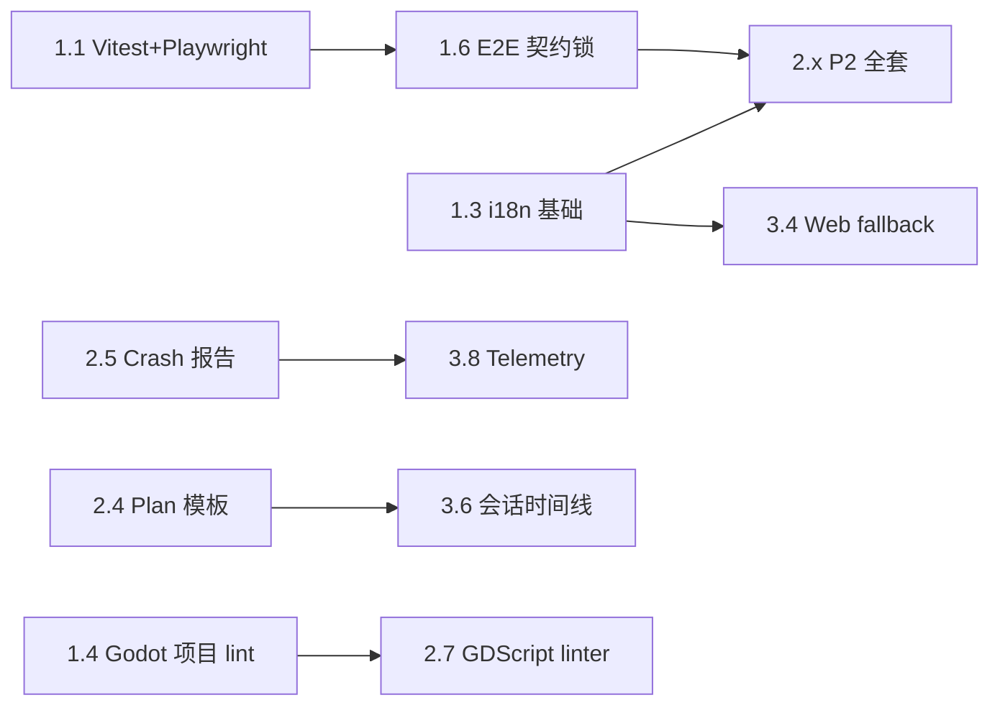

# X-agent 全量优化路线图

本文件把上一轮项目审查识别出的 20 项优化方向拆解为 22 个可执行里程碑，按 Phase 1-3 分阶段推进，并配 Phase 4 持续验证收尾。

> 来源：上一轮项目整体审查识别出的 20 项优化方向；本文件在其基础上做了依赖梳理与粒度拆分。
> 维护：每个里程碑完成后更新对应行的「完成度」与「最终交付」；新增方向请直接补到对应 Phase 末或下一 Phase。
> 关联：[`CONTEXT.md`](CONTEXT.md)（领域词表）/ [`CLAUDE.md`](CLAUDE.md)（工程约定）/ [`DESIGN.md`](DESIGN.md)（设计 token）/ [`AGENT.md`](AGENT.md)（Agent 协作约定）。

## 一、目标与非目标

### 1.1 目标

- **工程质量**：测试体系从「离线断言脚本」升级到「单元 + 集成 + E2E + 覆盖率门槛」
- **国际化**：UI 文案可双语 / 多语切换，建立 i18n 流程
- **Godot 深化**：从「运行 / 重载 / 导入」扩展到「场景内省 / 调试器 / 资源治理 / 导出」
- **可观测性**：崩溃报告、结构化日志、性能遥测
- **差异化**：插件市场、主题编辑器、Web fallback、多项目工作区

### 1.2 非目标（本期路线图不做）

- 替代 VS Code / Godot Editor 本体
- 完全云端化 / 实时多人协作
- 通用 LLM Chat 产品形态
- 移动端（iOS / Android）原生应用

## 二、阶段总览

| Phase | 周期 | 主题 | 关键交付物 | 状态 |
|---|---|---|---|---|
| **Phase 1** | M1-M2（4-6 周） | 工程质量 + Godot 深化 | Vitest + Playwright E2E；7 个 Godot 新工具；i18n 基础；E2E 契约锁 | 进行中（1.1/1.2/1.4/1.5 已完成；剩 1.3/1.6） |
| **Phase 2** | M2-M4（4-6 周） | 用户体验打磨 | 会话导出 / 导入；@-补全；开发者诊断页；Plan / Skill 模板；Crash 报告；A11y 自动化 | 待启动 |
| **Phase 3** | M4-M8（8-12 周） | 差异化能力 | 插件可视化市场；主题编辑器；快捷键中心；Web fallback；多项目工作区；会话时间线；CI 增强；Telemetry | 待启动 |
| **Phase 4** | 每个 Phase 末 | 验证与发版 | 综合回归 + 文档同步 + CHANGELOG 整理 | 持续 |

里程碑依赖图（粗体为本里程碑前置）：

---

## 三、Phase 1 — 工程质量 & Godot 深化（M1-M2）

### 1.1 引入 Vitest + Playwright E2E 框架  `P0`

- **目标**：测试体系从「60 个 tsx 离线断言」升级到「Vitest 单元 + Playwright E2E」，覆盖率进入 CI 门槛。
- **工作量**：5 人天（其中迁移 5 个关键模块 2 人天 / 配 CI 1 人天 / Playwright 基础 2 人天）
- **前置依赖**：无
- **状态**：✅ 已完成（2026-08）
- **完成度与最终交付**：
  - `apps/desktop/vitest.config.ts`：`environment: node`；`coverage.provider: v8`、`coverage.thresholds: { lines: 60, functions: 55, branches: 50 }`
  - **Vitest 迁移落地模块**（比计划多覆盖 2 个）：`cwd-sandbox` / `usage-store` / `shadow-checkpoints` / `retract-orchestrator` / `godot-rpc-bridge` + 共享层 `godot-rpc`、1.2 新增工具 `godot-tools`、1.5 `at-completion`；覆盖率实际 70%+（超过门槛）
  - `apps/desktop/e2e/`：`playwright.config.ts` 指向 Electron 入口；首批用例「应用可启动 + 主界面壳渲染 + 打开项目后 Plan/Agent 模式切换契约」（`app-shell.spec.ts` / `mode-switch.spec.ts`）
  - `apps/desktop/package.json`：新增 `test:unit` / `test:unit:watch` / `test:coverage` / `test:e2e`；保留 `test` 串联旧脚本
  - `.github/workflows/ci.yml`：新增 `unit-test`（覆盖率门槛）+ `e2e` 两个 job
  - 附带修复：`clampGodotRunWaitMs` 负数误钳到 0（应回退默认 3000）；`main.ts` 新增 `X_AGENT_ALLOW_MULTI=1` 放开单实例锁供 E2E 并行
- **遗留**：完整「新建会话 → 切 Plan → 撤回 → 切回 Agent」模型链路需真实 Pi 认证 / 模型 fixture，留给 ROADMAP 1.6 契约锁（e2e 目录已就绪）。
- **验收**：
  - `npm run desktop:test` 仍通过（旧断言脚本）✅
  - `npm run desktop:test:unit` 通过新 Vitest 套件，覆盖率门槛达标 ✅
  - `npm run desktop:test:e2e` 在本地通过核心场景 ✅（需先 `npm run build`）
  - CI 上 `unit-test` / `e2e` job 必跑且门槛生效 ✅
- **风险**：E2E 启动 Electron 慢；CI 已拆独立 job，PR 上跑全量冒烟用例（规模小，暂无 shard 需求）。

### 1.2 Godot 工具能力扩展（7 个新工具）  `P0`

- **目标**：把 10 个工具扩到 17 个，覆盖「场景内省 + 调试器 + 资源治理 + 导出 + 配置读写」五大缺口。
- **工作量**：8 人天
- **前置依赖**：`packages/godot-editor-rpc` 同步更新到 addon 0.4.0
- **状态**：✅ 已完成（2026-08）
- **完成度与最终交付**：
  - ✅ `godot_get_scene_tree(path, max_depth?)` — 场景树序列化（name / type / script），`max_depth` 钳制 [1,16]，默认 8
  - ✅ `godot_get_node_properties(path, node_path)` — 仅导出 `SCRIPT_VARIABLE` / `STORAGE` usage 属性
  - ✅ `godot_get_project_setting(key)` / `godot_set_project_setting(key, value)` — ProjectSettings 读写 + `save()` 落盘 project.godot
  - ✅ `godot_lint_scripts(paths)` — 进程内 `GDScript.reload()` 快速判错 + 失败文件 `--check-only` 子进程补行号（含 1.4 交付物）
  - ✅ `godot_find_unused_resources(root?)` — `res://` 路径 + `uid://` 双引用图扫描；`class_name` 脚本与 `addons/` 排除出候选
  - ✅ `godot_export_project(preset, output_dir, debug?)` — 异步子进程 `--headless --export-release`，未知 preset 返回可用列表
  - ✅ `godot_get_debugger_state()` / `godot_set_breakpoint(file, line, condition?, remove?)` — `EditorDebuggerSession.set_breakpoint()`（4.x 公开 API，spike 通过）+ 会话启动自动重放；Godot 4 断点无 condition 支持
  - addon 升 0.5.0（`plugin.cfg` + addon `CHANGELOG.md`）；修复 `_script_path_of` Variant 推断（4.4+ 警告当错误）
  - 测试：`shared/godot-rpc.test.ts`（白名单 + 超时档位）+ `electron/agent/godot-tools.test.ts`（mock bridge 锁协议契约）；**真实 Godot 4.5.1 端到端验证**（headless 编辑器 + 真 TCP 桥）：settings 读写回读、lint 行号 4/4/5、unused 命中/排除、断点应用/移除、导出子进程链路全部通过
- **交付物**：

| 新工具 | 类型 | 落点 |
|---|---|---|
| `godot_get_scene_tree(path)` | 只读 | `plugin.gd` 用 `EditorInterface.get_edited_scene_root()` 序列化 |
| `godot_get_node_properties(path, node_path)` | 只读 | 同上 + `get_property_list()` |
| `godot_set_breakpoint(file, line, condition?)` / `godot_get_debugger_state` | 调试器 | `EditorDebuggerSession.set_breakpoint()`（4.x 公开 API）+ 会话状态聚合 |
| `godot_find_unused_resources(root)` | 资源治理 | 文本引用图扫描（res:// + uid://），`class_name`/`addons` 排除 |
| `godot_export_project(preset, output_dir)` | 构建导出 | 异步子进程 `--headless --export-release`（不阻塞编辑器主线程） |
| `godot_lint_scripts(paths)` | 静态检查 | 进程内 reload + `--check-only` 子进程取行号 |
| `godot_get_project_setting(key)` / `set_project_setting` | 配置读写 | `ProjectSettings` + `save()` |

  - `shared/mode-tools.ts`：只读 5 个（get_scene_tree / get_node_properties / get_debugger_state / find_unused_resources / get_project_setting / lint_scripts）加入 `PLAN_MODE_OPTIONAL_READONLY_TOOLS`
  - `electron/agent/godot-tools.ts`：新增 7 个 `defineTool`；每个配 `promptGuidelines`
  - `shared/godot-rpc.ts`：注册新方法到 `GodotRpcCall` union + `GODOT_RPC_ALLOWED_METHODS`；`export_project` 5 分钟超时档、`find_unused_resources`/`lint_scripts` 4x 档
  - `electron/agent/turn-file-tracker.ts`：`set_project_setting` / `export_project` / `set_breakpoint` 计入 `MUTATING_GODOT_TOOLS`（撤回告警）
  - `packages/godot-editor-rpc/CHANGELOG.md` 升到 0.5.0
- **验收**：
  - 每个新工具有 vitest 断言（mock bridge）✅
  - addon 协议字段向后兼容旧版 0.3.0 插件（缺字段时降级）✅
  - 真实工程 E2E：settings / lint / unused / debugger / breakpoint / export 全链路通过 ✅
- **风险**：~~调试器 API 在 Godot 4.7 与 4.4 之间差异~~ → spike 结论：`EditorDebuggerSession.set_breakpoint` 为公开 API（4.x 全系），无需降级。

### 1.3 国际化基础（i18n）  `P0`

- **目标**：UI 文案从硬编码迁到 i18next，支持中 / 英双语切换。
- **工作量**：4 人天
- **前置依赖**：无
- **交付物**：
  - 引入 `i18next` + `react-i18next`（pin 到与 React 19 兼容版本）
  - `apps/desktop/src/locales/zh-CN.json` / `en.json`：首批覆盖 ChatPanel / Sidebar / TopBar / SettingsPanel / ReadyChecklist / ConfirmDialog
  - `apps/desktop/src/lib/i18n.ts`：初始化；首跑用 `navigator.language`，回退 `zh-CN`
  - 设置 → 通用加「语言」下拉；偏好 `ClientPrefs.locale` 持久化
  - `DESIGN.md` 加一节「i18n 文案约定」：占位、复数、时间格式
- **验收**：
  - 切换语言后整个 UI 即时刷新（不需重启）
  - 设置中可手动覆盖
  - `apps/desktop/scripts/check-i18n-keys.ts`：CI 校验两套 json 的 key 集合一致
- **风险**：HTML / MarkdownBody 内的英文代码块不动；只迁 UI 控件文案。

### 1.4 Godot 项目级 Lint（GDScript 静态检查）  `P1`

- **目标**：用 Godot 自身的 `GDScript.new().parse()` 做轻量 lint，挂在 `godot_lint_scripts` 工具上。
- **工作量**：与 1.2 合并
- **前置依赖**：1.2
- **状态**：✅ 已完成（2026-08，随 1.2 交付）
- **完成度与最终交付**：
  - `godot_lint_scripts(paths)` 返回 `{files: [{path, ok, issues: [{line, column, message, severity}]}]}`
  - 实现说明：Godot 4 无公开 parse error 细节 API（`Script.reload()` 只给错误码，且 4.4+ 错误码有重排），采用双层方案——进程内 `GDScript.reload()` 快速判错，失败文件走 `--check-only` 子进程取行号（`SCRIPT ERROR` 行 + 下一行 `at: ... (path:N)` 配对解析）；子进程不可用时 `error_string` 兜底
  - 真实验证：故意写错 `.gd`（类型错误 + 未声明标识符）返回行号 4/4/5
- **交付物**：addon 端 `lint_scripts(paths)` 返回 `{ file: { line, column, message, severity }[] }`
- **验收**：故意写一个语法错的 `.gd`，调用工具返回行号 + 错误信息。✅

### 1.5 @-补全基础  `P1`

- **目标**：实现 `@/文件` / `@skill` / `@mode` 三类补全；命令调出菜单。
- **工作量**：3 人天（1.3 完成后并行启动）
- **前置依赖**：1.3 文案稳定
- **状态**：✅ 已完成（2026-08）
- **完成度与最终交付**：
  - `src/lib/at-completion.ts`：`@` 触发解析 + 分类（path / skill / mode）+ 插入逻辑（`@skill:name`）
  - `src/hooks/useAtCompletion.ts`：监听光标 + 输入变化驱动候选；与 slash 菜单互斥优先级
  - `src/components/AtMenu.tsx`：复用 slash 虚拟列表样式，左侧 accent-blue 边条区分
  - `ChatPanel.tsx` 集成：键盘导航（↑↓ / Enter / Esc）；`pathCandidates` 预留 file-tree IPC 接入点
  - 测试：`src/lib/at-completion.test.ts`（vitest）
- **交付物**：
  - `src/hooks/useAtCompletion.ts`：监听 `@` 触发 + 解析后续字符；分类（path / skill / mode）
  - 复用 `SkillSlashMenu` 虚拟列表机制；新 `<AtMenu>` 组件
  - `ChatPanel.tsx` 集成；现有 `@路径` 引用文件逻辑保留为 `@/path` 别名
- **验收**：在编辑器里敲 `@sk` 弹出技能列表，选中后变为 `@skill:name` 插入。

### 1.6 E2E 契约锁（虚拟列表 / 模式切换 / 撤回）  `P1`

- **目标**：把 CHANGELOG 修过的虚拟列表缓存、行叠层、模式切换时序锁进 Playwright。
- **工作量**：与 1.1 并行（同一个 Playwright 配置）
- **前置依赖**：1.1
- **交付物**：`apps/desktop/e2e/contracts/*.spec.ts`：3-5 个契约用例
- **验收**：CI 上若契约回归失败，PR 阻断。

## 四、Phase 2 — 用户体验打磨（M2-M4）

### 2.1 会话导出 / 导入 / 复现  `P1`

- **目标**：会话可导出 Markdown（贴 issue）或 JSON（回放）；可从 JSON 导入新建会话。
- **工作量**：4 人天
- **前置依赖**：无
- **交付物**：
  - `shared/transcript/export.ts` / `import.ts`：
    - 导出：组装含 user / assistant / tool call / file changes 摘要的 Markdown；JSON 走结构化（`{meta, items, checkpoints}`）
    - 导入：JSON 校验后走 `session-lifecycle.createSession`，回放走 `session-event-bridge` 推流
  - 右栏新增「分享 / 导出」按钮；导出会写到系统下载目录（走 Electron `dialog.showSaveDialog`）
  - `session-lifecycle.ts` 加 `importSessionFromJson(json)` 入口
- **验收**：导出的 Markdown 在 VS Code 预览正常；导入的 JSON 能完整复现。
- **风险**：导入的 token / 文件路径要脱敏，避免跨机器污染。

### 2.2 开发者诊断页（Dev Diagnostics）  `P1`

- **目标**：在 `--x-agent-debug` 模式下新增一屏自检页。
- **工作量**：3 人天
- **前置依赖**：1.3（i18n）
- **交付物**：
  - 设置 → 通用 → 开发者下新增「诊断」入口
  - `apps/desktop/src/components/DevDiagnostics.tsx`：
    - 环境信息（Node / Electron / OS / GPU / 屏幕 / locale）
    - 当前会话状态（mode / turns / tokens / cost）
    - IPC 健康（每分面 ping 一次）
    - Godot RPC 桥状态 + 最近 20 条请求
    - Shadow Git 检查点树 + 存储占用
    - 「导出诊断包」按钮 → `app.getPath(temp) + zip`
  - IPC：`register-dev-ipc.ts`：新增 `dev:ping`、`dev:getSnapshot`、`dev:exportBundle`
- **验收**：诊断包可作 issue 附件上传；ping 各分面超时显式报错。

### 2.3 Plan 模板 + Skill 模板  `P1`

- **目标**：Plan 模式内置 5 个模板；用户可在 UI 内创建自定义 Skill 模板。
- **工作量**：3 人天
- **前置依赖**：无
- **交付物**：
  - `packages/godot-pi/templates/plan/*.md`：5 个内置（加新场景 / 修 bug / 导出构建 / 重构 / 接入新工具）
  - `src/components/PlanTab.tsx` 加「模板」按钮 + 弹窗列表
  - `src/components/SkillCreatorWizard.tsx`：名称 / 描述 / 步骤 / 触发条件，写到 `~/.pi/agent/skills/` 下
  - IPC：`workspace.createSkillFromTemplate(payload)`、`workspace.listPlanTemplates()`
- **验收**：选择模板后右栏 markdown 自动填好；新建 Skill 后 `/skill` 菜单能立即看到。

### 2.4 Crash 报告与 Sentry 接入  `P1`

- **目标**：主进程未捕获异常 + 渲染进程未处理拒绝自动上报。
- **工作量**：4 人天
- **前置依赖**：无
- **交付物**：
  - 新增 `@sentry/electron`（或自托管 Sentry / GlitchTip）
  - `electron/main.ts`：`Sentry.init({ dsn, beforeSend: 脱敏 apiKey/user.email })`
  - `electron/preload.ts` + 渲染：监听 `unhandledrejection` 上报
  - 设置 → 通用 → 诊断数据共享开关（关闭则不上报）
  - 首次启动若有历史 crash 文件，弹窗询问是否上传
- **验收**：手动 throw 在主进程能触发事件；开关关闭后完全不上报。
- **风险**：DSN 暴露可能带来垃圾；可用 `beforeSend` 限流。

### 2.5 A11y 自动化  `P1`

- **目标**：引入 axe-core 自动校验；键盘可达性测试。
- **工作量**：3 人天
- **前置依赖**：1.1（Playwright 基础）
- **交付物**：
  - `apps/desktop/e2e/a11y/`：`@axe-core/playwright` 在主要页面（Chat / Settings / PlanTab / ReadyChecklist）跑一遍
  - 关键交互的键盘测试：Tab 顺序、Esc 关闭 modal、Enter 提交
  - CI 上 a11y 失败阻断
- **验收**：四屏 axe-core 0 violations；键盘流程 PR 截图对比通过。

### 2.6 GDScript / Python 嵌入式 Linter / Formatter 集成  `P2`

- **目标**：检测到 `gdlint` / `gdformat` 时自动跑，给出反馈。
- **工作量**：2 人天
- **前置依赖**：1.4（项目 lint 基础）
- **交付物**：
  - `electron/agent/godot-tools.ts` 新增 `godot_lint_with_gdlint(paths)`（调用 `gdlint` 二进制）
  - 与 `x-safe-edit` skill 联动
- **验收**：项目里安装 gdlint 后，写入新 .gd 会触发 lint 建议。

### 2.7 自动 commit / PR 描述生成（建议性）  `P2`

- **目标**：Agent 完成实质工作后自动生成 Conventional Commit；可选生成 PR 描述（不进 GitHub API）。
- **工作量**：3 人天
- **前置依赖**：2.1（导出能力借鉴）
- **交付物**：
  - `electron/agent/git-commit-msg.ts`：基于变更文件 + 摘要走 LLM 生成 commit message
  - 右栏「Git」页签（新建）：显示建议 commit + 「复制到剪贴板」按钮
- **验收**：复制内容符合 Conventional Commit 规范。

## 五、Phase 3 — 差异化能力（M4-M8）

### 3.1 插件 / Package 可视化市场  `P2`

- **目标**：设置 → 插件 → Packages 新增「浏览市场」Tab，从 Pi 官方 registry（或自建）拉取列表。
- **工作量**：6 人天（含后端若需自建）
- **前置依赖**：无（但若 Pi 官方不开放 registry API，需自建）
- **交付物**：
  - 新 IPC：`package.search(query)`、`package.getDetail(id)`、`package.install(id)`（包装现有 `pi install`）
  - `src/components/PackageMarket.tsx`：列表 + 详情 + 一键安装
  - 自建 registry 最小版：`registry.json` + S3 静态托管（如不依赖 Pi）
- **验收**：能搜到 `godot-pi` 并安装；评分 / 描述正常展示。
- **风险**：供应链；保留现有「跳过 npm lifecycle scripts」硬闸。

### 3.2 主题 / Token 编辑器  `P2`

- **目标**：用户在 UI 内调整 `--bg-app` 等 token，实时预览并导出为 JSON。
- **工作量**：4 人天
- **前置依赖**：无
- **交付物**：
  - `src/components/ThemeEditor.tsx`：色板 + token 列表 + 实时预览
  - 主题存到 `~/.pi/agent/x-agent-themes/*.json`；与现有主题族共存（覆盖而非替换）
  - 设置 → 通用新增「自定义主题」下拉
- **验收**：用户调一个 token 颜色，全 UI 即时刷新；导出 JSON 后另一台机器导入能用。

### 3.3 全局快捷键中心  `P2`

- **目标**：设置 → 通用新增「键盘快捷键」页：列出全部快捷键 + 搜索 + 自定义绑定。
- **工作量**：3 人天
- **前置依赖**：无
- **交付物**：
  - `shared/shortcuts.ts`：常量表（Shift+Tab / Ctrl+Shift+I / F12 等）
  - `src/components/ShortcutCenter.tsx`：列表 + 重绑
  - 持久化：`ClientPrefs.shortcuts` patch
- **验收**：重绑后生效；冲突时给警告。

### 3.4 Web fallback（远程 / 浏览器版）  `P2`

- **目标**：renderer 拆成可独立部署的 Next.js 子项目，与主进程通过 WebSocket 桥接同一套 IPC。
- **工作量**：12 人天
- **前置依赖**：1.3（i18n）
- **交付物**：
  - 新仓库（或 monorepo 新增）`apps/web/`：Next.js + React 19；复用 `src/components/`、`src/hooks/`、`src/lib/`
  - IPC 抽象：把现有 `window.xAgent.*` 包成 WS 客户端
  - 主进程加 `electron/agent/ws-bridge.ts`：监听 `ws://127.0.0.1:port`（仅本机）
- **验收**：浏览器能完整使用 Chat / Plan / Goal；Godot RPC 仅在桌面端可用，Web 上明示「需桌面端」。
- **风险**：WS 鉴权需谨慎；考虑 short-lived token。

### 3.5 多项目工作区（Workspace）  `P2`

- **目标**：可同时挂多个项目 cwd，会话按 workspace 隔离。
- **工作量**：6 人天
- **前置依赖**：Godot RPC 多客户端已在 `godot-rpc-bridge.ts` 实现（`clientId` 分配），需 UI 暴露
- **交付物**：
  - `shared/workspace.ts`：workspace 概念（`{id, name, cwd, sessions[]}`）
  - `src/components/WorkspaceSwitcher.tsx`：左栏顶部下拉
  - `session-lifecycle.ts`：会话归属 workspace
  - Godot：右栏 Godot 页签可看多个编辑器实例 + 切换活动
- **验收**：两个项目同时开，互不污染；Godot 编辑器可分别控制。

### 3.6 会话时间线 / 可视化回放  `P2`

- **目标**：右栏新增「时间线」页签，把整次会话画成时间轴，可跳转到该时刻预览。
- **工作量**：5 人天
- **前置依赖**：2.1（导出借鉴）
- **交付物**：
  - `src/components/SessionTimeline.tsx`：事件列表 + 缩略图；点击跳到 transcript 那一刻
  - 数据来源：`session-history`（已在 `retract-orchestrator.ts` 中记录）
- **验收**：长会话能 1 秒内定位关键事件。

### 3.7 CI 工作流增强  `P2`

- **目标**：CI 增 `actionlint` / `npm audit` / CHANGELOG 一致性；Windows 单平台跑全量。
- **工作量**：3 人天
- **前置依赖**：无（依赖现有 CI 基础设施）
- **交付物**：
  - `.github/workflows/ci.yml`：拆 4 个 job（typecheck / test / build / release-validate）
  - 新增 `release-validate.yml`：校验 CHANGELOG 的 Unreleased 段在 PR 时被更新
  - `actionlint` 跑在 `lint-workflows` job
  - `npm audit --audit-level=high` 失败阻断
- **验收**：合并到 main 时四个 job 都绿。

### 3.8 Telemetry / 性能监控  `P2`

- **目标**：主进程定期采样（内存 / 帧率 / IPC 延迟），写入 `perf.log`；设置 → 用量 → 新增「性能」节。
- **工作量**：4 人天
- **前置依赖**：2.4（崩溃报告基础设施）
- **交付物**：
  - `electron/agent/perf-sampler.ts`：30s 采样
  - `src/components/PerfTab.tsx`：内存趋势图 + 长会话首 token 延迟
  - 可选 Prometheus exporter（`/metrics`）
- **验收**：连续运行 1 小时后能绘出趋势图。

---

## 六、Phase 4 — 验证与发版（持续）

每个 Phase 末必须做：

- **回归**：跑全量 Vitest + Playwright E2E + 真实模型冒烟（`smoke-session.ts`）
- **契约**：CHANGELOG.md 已整理；git tag 与 `apps/desktop/package.json` 一致
- **文档**：
  - 同步 `CLAUDE.md` / `CONTEXT.md` 中模块路径与发版约定
  - 同步 `DESIGN.md` 中新增的 token / 组件（如 1.3 i18n）
  - `README.md` / `README.en.md` 中能力列表对齐（双语文案）
- **发布**：`npm run release:prepare -- x.y.z` + tag 触发 CI
- **回滚预案**：每个 P0 改动配 `git revert` 演练记录

---

## 七、风险登记

| # | 风险 | 影响面 | 缓解 | 触发条件 |
|---|---|---|---|---|
| R1 | E2E 在 CI 慢 / 不稳 | Phase 1.1 | 分支策略：main 跑全量、PR 跑契约子集；shard | CI 5 次连续失败 |
| R2 | Vitest 迁断言脚本改写大量代码 | Phase 1.1 | 选 5 个模块试点，成功后批量迁移；保留旧脚本并行 | 单模块迁移超 1 人天 |
| R3 | Godot 4.4 / 4.7 API 差异 | Phase 1.2 | addon 内部 try/catch + 降级；CI 在两个 Godot 版本矩阵跑 | 工具失败率 > 5% |
| R4 | i18n 大量硬编码迁移 | Phase 1.3 | 顶层组件优先；保留 fallback 文案；CI 校验 key 集合 | PR review 中发现遗漏 > 10 处 |
| R5 | Sentry DSN 暴露 / 滥用 | Phase 2.4 | `beforeSend` 限流 + 脱敏；环境变量注入 | 7 天内上报 > 10k 条 |
| R6 | Web fallback 工程量大 / 推迟 | Phase 3.4 | 严格 scope 收敛：先 1 个视图；不做实时协同 | 12 人天超期 50% |
| R7 | 多项目 workspace 与现有会话隔离冲突 | Phase 3.5 | 渐进：先只支持 2 个 workspace；旧会话迁移脚本 | 回归测试失败 > 3 处 |
| R8 | Pi 官方 registry API 不开放 → 自建 | Phase 3.1 | MVP 用静态 json + S3；后续考虑 CDN 缓存 | Pi 团队 1 个月内未答复 |
| R9 | 主题编辑器改 token 导致 a11y 退化 | Phase 3.2 | 强制 WCAG AA 对比度阈值；超阈值给警告 | 任意 token 改动 |

---

## 八、度量指标

按月统计，触发条件出现需在 PR 中说明。

| 指标 | 当前 | Phase 1 末 | Phase 2 末 | Phase 3 末 |
|---|---|---|---|---|
| 主进程单测覆盖率（lines） | 0% | ≥ 60% | ≥ 70% | ≥ 75% |
| E2E 用例数 | 0 | ≥ 5（契约） | ≥ 15 | ≥ 30 |
| UI 文案 i18n 覆盖率 | 0% | 顶层 5 组件 100% | ≥ 80% | ≥ 95% |
| Godot 工具数 | 10 | 19（含 1.2 全部 7 个 + lint） | 19 + 外部 linter | 19 + 外部 linter |
| Crash 报告接入 | 无 | 无 | 已接入 | 已接入 + 性能 |
| 用户活跃会话数 / 月（基线） | — | 取基线 | 提升 ≥ 10% | 提升 ≥ 30% |
| 首次响应延迟 P50 | — | 取基线 | 持平或更优 | 持平或更优 |

---

## 九、维护约定

- 每个里程碑完成后由负责人：
  1. 在 `CHANGELOG.md` 的 `## Unreleased` 加条目
  2. 在本表对应行更新「完成度」与「最终交付（PR 链接）」
  3. 同步 `CLAUDE.md` / `CONTEXT.md` 中路径变更
- 新增方向请直接补到对应 Phase 末或下一 Phase，不要重排整体顺序
- Phase 切换需在 issue / discussion 中说明触发条件（度量指标达标 + 无 P0 缺陷）
- 本文件不进 `docs/`（个人草稿区），根目录作为对外可见的发布物随版本演进

