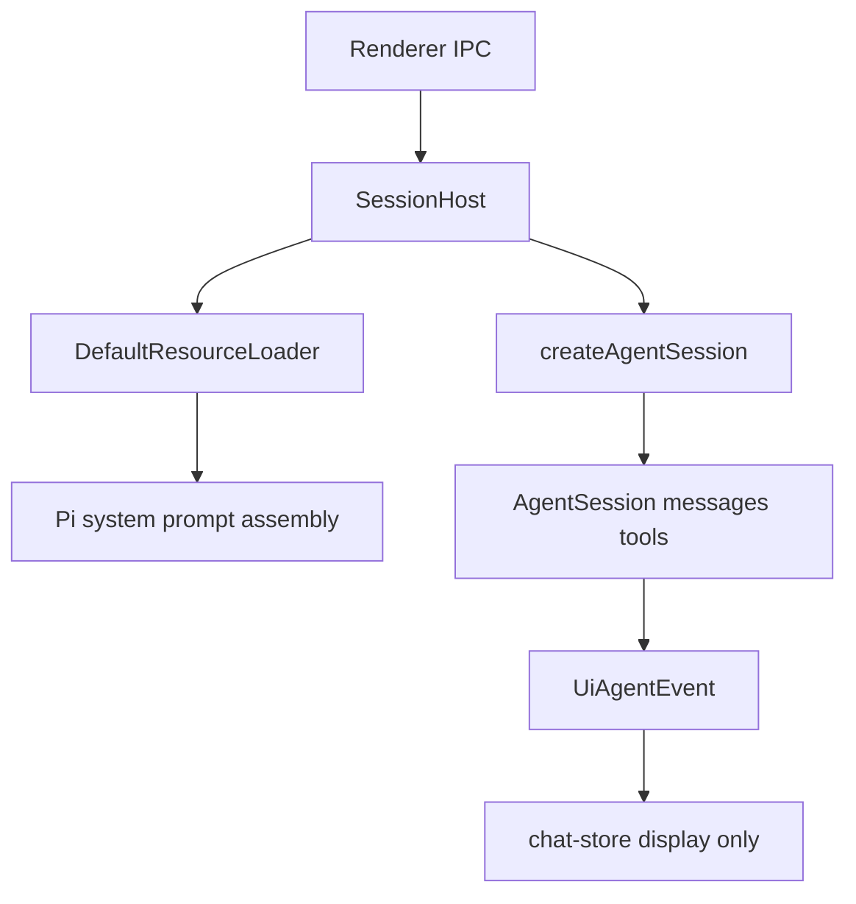

# Agent 上下文说明

本文说明 X-agent 里 **模型实际看到的上下文** 如何组织与生效。受众：维护本仓库的开发者、排查「模型到底知道什么」的人。

相关文档：[`CLAUDE.md`](CLAUDE.md)（项目指引）、[`pi-plugin-guide.md`](pi-plugin-guide.md)（插件类型）、[Pi SDK](https://pi.dev/docs/latest/sdk)。

---

## 核心结论

X-agent **不手写 LLM context**。真正组装发生在 `@earendil-works/pi-coding-agent` 的 `DefaultResourceLoader` + `createAgentSession`（内部 `buildSystemPrompt`、会话消息、compaction）。

本应用只做：

- 选定项目 `cwd`、全局 `agentDir`（`~/.pi/agent`）
- 传入可切换工具全集 + 当前白名单、model、thinking、Godot / 文档 `customTools`
- 经 `skillsOverride` 排除用户家目录 `~/.agents/skills`（避免无关技能膨胀索引）
- 会话落盘到隔离目录 `~/.pi/agent/x-agent/sessions/`（与 Pi CLI 的 `sessions/` 分开）
- 可选手动压缩：右栏「压缩上下文」→ `session.compact()`
- **不**使用 `systemPromptOverride`

主接线点：[`apps/desktop/electron/agent/session-host.ts`](apps/desktop/electron/agent/session-host.ts) 的 `createSession`。

UI 侧的 `history` / `truncate` / `chat-store` **只用于展示**，不是第二套 context builder。

---

## 总览数据流



1. Renderer 经 IPC 打开项目 / 发 prompt / 改 prefs。
2. `main.ts` 将请求交给单个 `SessionHost`。
3. `SessionHost.createSession` 创建 `DefaultResourceLoader({ cwd, agentDir, skillsOverride })`，`reload()` 后交给 `createAgentSession`。
4. Pi 组装 system prompt、启用工具、恢复/创建会话消息；后续 `prompt` 写入同一 `AgentSession`。
5. 事件经 `agent:event` 推到 renderer；`applyAgentEvent` 归并展示。

---

## 模型实际看到的上下文分层

以下顺序对应 Pi 侧 system / 消息组装（X-agent 未覆盖这些钩子时的默认行为）。

### 1. System 基座

- 默认：Pi coding-assistant 系统提示（工具说明、通用准则等）
- 或替换：存在 `SYSTEM.md` 时用之；**项目** `.pi/SYSTEM.md` 优先于 **全局** `~/.pi/agent/SYSTEM.md`

### 2. Append

- `APPEND_SYSTEM.md`（项目与全局，有则追加）

### 3. `<project_context>`

- 发现 `AGENTS.md` / `CLAUDE.md`（及大小写变体）
- 全局：`~/.pi/agent/AGENTS.md`（或 CLAUDE）
- 再从文件系统根向 `cwd` 向上 walk；同目录优先 `AGENTS.md`
- **全文**进入 system（不是索引）

### 4. `<available_skills>`

- 已发现技能的 **名称 / 描述 / 路径** 索引
- 完整 `SKILL.md` **不**预装；模型需要时用 `read`（或 slash skill）按需加载
- 若 `read` 未在工具白名单中，技能索引可能被省略（Pi 行为）

### 5. CWD 与工具面

- 一行当前工作目录
- 已启用工具的名称与描述；Godot 等 `customTools` 的 `promptSnippet` / `promptGuidelines` 进入工具说明
- Extension 注册的工具同样受白名单约束

### 6. 会话消息（对话上下文）

- 持久化在 `SessionManager` 管理的会话文件（根：`~/.pi/agent/x-agent/sessions/`）
- 恢复会话 = 恢复同一消息历史给模型
- 超窗时由 **Pi 自动 compaction**（摘要 + 保留窗口）
- 另可在右栏「上下文」手动触发：`SessionHost.compactSession` → `session.compact()`（流式中不可用）

### 7. 按需写入（非 system 预装）

运行中工具结果、仓库文件内容、技能正文等进入后续 messages，不在会话创建时全部塞进 system。

### Prompt 模板 vs 上下文

| 类型 | 是否自动进 system | 说明 |
|---|---|---|
| Skill | 仅元数据索引 | 正文 on-demand |
| Prompt 模板（`.pi/prompts/`） | 否 | 用户调用 `/name` 时展开为用户消息 |
| Extension | 间接 | 工具、命令、事件钩子（可改 system / 发消息） |
| Theme | 否 | 仅 UI |

资源发现根：

- 项目：`cwd/.pi/{skills,extensions,prompts,themes}/`、向上的 `.agents/skills/`、`AGENTS.md`/`CLAUDE.md`、`.pi/SYSTEM.md` 等
- 全局：`~/.pi/agent/` 下同类目录与文件
- Packages：经 `pi install` 落入 Pi 安装布局后由 loader 发现

---

## X-agent 显式传入的会话参数

`createSession` 中（概念对照）：

```ts
const loader = new DefaultResourceLoader({
  cwd,
  agentDir,
  skillsOverride: (base) => ({
    skills: excludeUserAgentsHomeSkills(base.skills),
    diagnostics: base.diagnostics,
  }),
});
await loader.reload();

await createAgentSession({
  cwd,
  agentDir,
  resourceLoader: loader,
  modelRuntime,
  sessionManager,
  tools: [...ALL_TOGGLEABLE_TOOLS],
  customTools: [
    ...(godotRpc ? createGodotTools(godotRpc) : []),
  ],
  model: selectedModel,
  thinkingLevel: prefs.thinkingLevel,
});
session.setActiveToolsByName(prefs.tools);
```

| 参数 | 来源 | 作用 |
|---|---|---|
| `cwd` | 打开的项目路径 | 工具 FS 根；项目资源发现 |
| `agentDir` | Pi `getAgentDir()` → 通常 `~/.pi/agent` | 全局资源 / settings |
| `resourceLoader` | `DefaultResourceLoader` + `reload()` + `skillsOverride` | skills / extensions / prompts / themes / context files |
| `tools`（注册） | `ALL_TOGGLEABLE_TOOLS` | 可切换全集；否则后续勾选会被静默忽略 |
| 实际启用 | `prefs.tools` via `setActiveToolsByName` | 当前白名单 |
| `customTools` | [`godot-tools.ts`](apps/desktop/electron/agent/godot-tools.ts) | Godot RPC 工具（是否可调用仍看白名单） |
| `model` / `thinkingLevel` | prefs + `ModelRuntime`（auth / models） | 选用模型与推理级别 |
| `sessionManager` | `create` / `continueRecent` / `open`，根在 `x-agent/sessions/` | 对话持久化与恢复 |

**本应用已定制**：`skillsOverride`（排除 `~/.agents/skills`，见 [`exclude-agents-home-skills.ts`](apps/desktop/electron/agent/exclude-agents-home-skills.ts)）。

**未传入**：`systemPromptOverride`、`promptsOverride`、`agentsFilesOverride`、`extensionFactories`、`SettingsManager`、`noTools` / `excludeTools` 等。更深行为以 Pi SDK 为准。

偏好文件：[`prefs.ts`](apps/desktop/electron/agent/prefs.ts) ↔ `~/.pi/agent/x-agent.json`。与上下文相关的字段：

| Pref | 是否进入模型上下文 |
|---|---|
| `provider` / `model` | 是（选用哪个模型） |
| `thinkingLevel` | 是 |
| `tools` | 是（可用工具集） |
| `showThinking` | 否（仅 UI） |
| `theme` | 否 |
| `lastProjectPath` / `lastSessionPath` | 否（启动恢复；由当前 `SessionHost` 写回） |
| `godotEditorPath` | 否（启编辑器用） |
| `rightPanelOpen` / `sidebarWidth` / `rightPanelWidth` | 否（布局） |
| `hiddenProjectKeys` | 否（侧栏隐藏） |

---

## 插件与 Packages 如何进入上下文

- [`plugin-host.ts`](apps/desktop/electron/agent/plugin-host.ts)：在全局 `~/.pi/agent/{prompts,skills,extensions,themes}` 与项目 `cwd/.pi/...` 做 CRUD；写入的是 **Pi 会扫描的文件树**，不是另一套注入 API。
- 插件变更后：IPC → `SessionHost.reloadResources()` → `session.reload()`。
- [`package-manager.ts`](apps/desktop/electron/agent/package-manager.ts)：封装 `pi install` / `pi uninstall`，并在 `x-agent-packages.json` 记账；**真正加载**仍是 Pi loader。
- 类型语义见上表；主题不进 LLM。细节见 [`pi-plugin-guide.md`](pi-plugin-guide.md)。

---

## 工具与 Godot 贡献面

### 内置工具

[`shared/ipc.ts`](apps/desktop/shared/ipc.ts) 的 `AVAILABLE_TOOLS`：`read`、`bash`、`edit`、`write`、`grep`、`find`、`ls`。默认 prefs 全部开启。

### Godot（三条通道）

1. **桌面编辑器 `customTools`**（[`godot-tools.ts`](apps/desktop/electron/agent/godot-tools.ts)）  
   - 桥接存在时 **注册**；prefs 勾选对应名后才 **active**（`GODOT_TOOLS`，默认不在白名单）。  
   - `promptSnippet` / `promptGuidelines` 进入工具说明，引导模型何时调用。


3. **godot-pi Package**  
   - 技能教领域流程与何时用 RPC；扩展可注册如 `godot_detect_project` 等工具（仍受白名单过滤）。  
   - 安装后需资源重载或新会话才会进 loader。

[`godot-rpc-bridge.ts`](apps/desktop/electron/agent/godot-rpc-bridge.ts) 由当前 `SessionHost` 使用；多编辑器客户端经 `setActiveClient` 选路（与会话无关）。

---

## 隔离边界一览

| 边界 | 说明 |
|---|---|
| Session 文件 | 仅 `~/.pi/agent/x-agent/sessions/`；恢复路径须在该根下 |
| Project cwd | 工具与项目 `.pi` / AGENTS 相对该根 |
| 全局 prefs | `x-agent.json` 一份；写 last paths / 当前模型偏好 / 布局 |
| Skills | 排除 `~/.agents/skills`；保留 `~/.pi/agent/skills`、项目 skills、Packages |
| Pi auth / models | `auth.json` / `models.json`，与 CLI 共用。自定义供应商模型应写 `contextWindow`（tokens）；未写时 Pi 默认 **128000**。X-agent 预设、拉取 `/v1/models`、以及已知模型启发式会在保存/激活时自动补全。 |
| 用量 | `x-agent-usage.json` 本地汇总；右栏另有会话内 snapshot |
| UI transcript | 展示层；截断不影响 Pi 侧完整会话（受 Pi compaction 约束） |

---

## 运行时行为（影响下一轮上下文）

| 行为 | 位置 | 效果 |
|---|---|---|
| 空闲 `prompt(text)` | `SessionHost` | 正常用户轮次，消息进入会话历史 |
| 流式中再发 | `streamingBehavior: "steer"` | 当前工具轮次后注入转向消息（否则 Pi 会报错） |
| 撤回 / 编辑重发 / 重新生成 | `navigateTree` + **Shadow Git**（优先）/ `TurnFileTracker`（无 Git 降级） | 对话改 leaf（append-only 树）。有本机 Git 时：`prompt` 前打 Shadow pre 检查点，`turn_end` 打 post；撤回时**按 diff 路径还原** target→HEAD 之间变化过的文件（不整库 reset --hard，回合期间用户手动编辑且 Agent 未触碰的路径保留；独立 `GIT_DIR` 在 `~/.pi/agent/x-agent/checkpoints/`，**不写用户 `.git`**）。无 Git 时仍只还原 `write`/`edit` 字节基线。**注意**：Pi 在 `message_end` 之后才 `appendMessage`，active user / Shadow pre 必须在 append 之后绑定（`tool_execution_start` / `queueMicrotask`），不能在 `message_start` 取 leaf。Godot 仅对会改编辑器状态的工具告警；cwd 外 bash 副作用仍不保证。 |
| `compactSession` | 右栏上下文 | 手动 `session.compact()`；更新用量 snapshot |
| `setActiveToolsByName` / `applyTools` | prefs 变更 | 当场改可用工具集并**重建 system prompt**；清空本会话 API 前缀缓存命中 |
| `setModel` / `setThinkingLevel` | 顶栏 / 设置 | 影响后续请求；中途改 Thinking/换模型也可能改变历史消息序列化，破坏前缀缓存 |
| `session.reload()` | 插件保存后 | 重载资源 |

切换项目 / 新会话 / 恢复前会释放当前 session bundle。

### 前缀缓存（DeepSeek 等）

DeepSeek 等供应商对**完全一致的请求前缀**计为 cache hit（Pi 记为 `cacheRead`）。稳态多轮 append-only 可命中；下列操作会破坏命中：改工具白名单、压缩、撤回/分支、流式 steer、中途改 Thinking/模型。

右栏「上下文」与设置「用量」展示 **命中率 = cacheRead / (input + cacheRead)**。

**代理上的 DeepSeek 模型**：Pi 仅在 `provider === "deepseek"` 或 `baseUrl` 含 `deepseek.com` 时自动启用 DeepSeek compat。经 SiliconFlow / OpenRouter / 自建 openai-compatible 中转时，激活档案会为模型 id 含 `deepseek` 的条目写入 `reasoning` + `compat.thinkingFormat: "deepseek"`（见 `provider-store` 的 `deepseekProxyModelExtras`），以保证 `reasoning_content` 回传与 thinking 参数形态正确。官方 `api.deepseek.com` 仍走 Pi 自动检测，不重复写入。

---

## 排障：「模型怎么会知道 / 不知道 X？」

按层排查：

1. **项目约定** — `cwd` 向上是否有 `AGENTS.md` / `CLAUDE.md`？是否被 `SYSTEM.md` 整段替换？
2. **技能** — 是否在 `~/.pi/agent/skills`、`cwd/.pi/skills` 或已安装 package 路径？（`~/.agents/skills` 会被故意排除）`read` 是否启用？改完是否执行了 reload？
3. **工具** — 设置 → 工具白名单是否包含该工具名？Godot 编辑器 / 文档是否勾选？桥是否已连接 / 文档是否已导入？
4. **会话** — 是否续了旧会话（历史里已有错误假设）？是否误以为 UI 截断等于模型上下文被截断？是否需要手动压缩？
5. **Packages** — `pi install` 是否成功？`x-agent-packages.json` 只是记账，loader 失败时需查 Pi 安装目录与日志。

---

## 关键源码索引

| 路径 | 角色 |
|---|---|
| [`session-host.ts`](apps/desktop/electron/agent/session-host.ts) | 创建会话、prompt/steer、撤回/重发、compact、reload |
| [`provider-store.ts`](apps/desktop/electron/agent/provider-store.ts) | 供应商档案 → Pi auth/models；激活时写入 `contextWindow` |
| [`model-context.ts`](apps/desktop/shared/model-context.ts) | 已知模型上下文启发式 + API 字段解析 |
| [`model-fetch.ts`](apps/desktop/electron/agent/model-fetch.ts) | 拉取 `/v1/models`（含 context_length） |
| [`exclude-agents-home-skills.ts`](apps/desktop/electron/agent/exclude-agents-home-skills.ts) | `skillsOverride` 过滤 |
| [`turn-file-tracker.ts`](apps/desktop/electron/agent/turn-file-tracker.ts) | write/edit 字节基线与还原 |
| [`context-breakdown.ts`](apps/desktop/electron/agent/context-breakdown.ts) | 右栏上下文组成拆解 |
| [`usage-store.ts`](apps/desktop/electron/agent/usage-store.ts) | 本地按日 / 按模型用量 |
| [`shared/transcript/`](apps/desktop/shared/transcript/) | Pi branch entries → UI（`branch-mapper` 等；含 entryId；非 LLM 组装） |
| [`plugin-host.ts`](apps/desktop/electron/agent/plugin-host.ts) | 插件 CRUD → Pi 目录 |
| [`package-manager.ts`](apps/desktop/electron/agent/package-manager.ts) | `pi install` / uninstall |
| [`godot-tools.ts`](apps/desktop/electron/agent/godot-tools.ts) | Godot 编辑器 customTools |
| [`chat-store.ts`](apps/desktop/src/stores/chat-store.ts) | UI 事件归并 |
| [`shared/ipc.ts`](apps/desktop/shared/ipc.ts) | 工具名、prefs 类型 |
