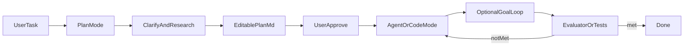

# 主流 Agent：计划模式 vs 目标模式调研

> 调研日期：2026-07-31  
> 参考语境：[Pi插件指导文档.md](../Pi插件指导文档.md)；X-agent 当前无 plan/goal 一等公民模式，但已有工具白名单基础（[`session-host.ts`](../apps/desktop/electron/agent/session-host.ts)）。  
> 范围：对照 Cursor / Claude Code / Codex / Windsurf 的产品语义与机制，映射到 Pi Extensions / X-agent 可落地点。§6 为早期 Extension 规格；**实际交付见 §9（宿主一等公民）**。

## 一句话区分

| | **计划模式 (Plan Mode)** | **目标模式 (Goal Mode)** |
|---|---|---|
| 问题 | **做什么、怎么做**（先对齐再动手） | **做到什么为止**（自主多轮直到可验证终点） |
| 侧效应 | 通常禁止或强烈抑制写盘 | 允许写盘/跑命令，强调持续执行 |
| 产物 | 可审阅的 Markdown 计划 + 可选 todos | 持久目标契约 + 完成判定 |
| 人机门闩 | 批准计划后才 Build/Implement | 暂停/清除；完成靠验证器而非主模型自报 |

主流工作流几乎都是：**Plan →（批准）→ 执行；复杂/长任务再挂 Goal**。



---

## 1. 计划模式：四家怎么做

### 1.1 Cursor — 「研究 + 可编辑计划 + Build」

来源：

- https://cursor.com/docs/agent/plan-mode
- https://cursor.com/blog/plan-mode

要点：

- 入口：模式切换 / `Shift+Tab`；复杂任务可自动建议
- 行为：澄清问题 → 搜代码库 → 生成 Markdown 计划（路径/引用/todos）→ 用户可内联编辑 → **Build** 再执行
- 持久化：默认家目录；可「Save to workspace」供团队共享
- 机制特征：**专用 plan 工具 + 交互式计划编辑器**；强调「先想清楚再写」而非单纯只读 Ask
- 失败恢复：改坏了 → 回退 diff → 改计划 → 再 Build（比在半成品上追问更快）

### 1.2 Claude Code — 「权限态硬只读 + ExitPlanMode」

来源：

- https://code.claude.com/docs/en/permission-modes
- https://code.claude.com/docs/en/best-practices

要点：

- 入口：`Shift+Tab` / `/plan` / `claude --permission-mode plan`
- **硬约束**：`plan` 是 permission mode；源码编辑被挡；可读/搜/探索性 shell；批准计划后才切到 `acceptEdits` / `auto` / 手动审编辑等
- 结束门闩：模型调用退出计划流程，UI 展示计划供批准（含 auto / 逐文件审等选项）
- 推荐四阶段：探索 → 写计划 →（Ctrl+G 外编）→ 退出 plan 再实现 → commit/PR
- 与 Cursor 差异：**工具权限层强制只读**，不是「靠 prompt 自觉」

### 1.3 OpenAI Codex — 「/plan 预飞 + ExecPlan 活文档」

来源：

- https://developers.openai.com/codex/learn/best-practices
- https://github.com/openai/openai-cookbook/blob/main/articles/codex_exec_plans.md

要点：

- `/plan`：复杂/模糊任务先规划、澄清；与 Goal **分工明确**（先 plan 再 goal）
- ExecPlan：可执行规格文档（Progress / Decision Log / Validation 等），执行中持续更新——计划不仅是开工前快照，也是过程账本

### 1.4 Windsurf Cascade — 「计划文件 + Implement」

来源：

- https://docs.windsurf.com/windsurf/cascade/modes
- https://devin.ai/blog/windsurf-wave-10-planning-mode

要点：

- 模式：Code / Plan / Ask（Ask 才是搜索工具 only）
- Plan：探索、澄清、多方案选择、写出外部 Markdown；**Implement** 切 Code
- 计划存 `~/.windsurf/plans`，可 `@` 引用跨会话继续
- Wave 10 强调：**可修改 + 持久化** 的计划文件，执行中 agent 可随新信息改计划并通知用户
- 注意：文档表里 Plan 写「All tools enabled」——比 Claude **更软**；真正硬只读在 Ask

### 1.5 计划模式共性（产品原语）

1. **模式切换**（UI / 快捷键 / slash），与普通 Agent 并列
2. **澄清问题**（有限多选优先）
3. **只读或弱副作用研究**（Claude 硬挡；Cursor/Windsurf 偏约定 + 流程）
4. **可编辑 Markdown 计划**（路径、步骤、todos、可选图）
5. **显式批准门闩**（Build / Implement / ExitPlanMode）
6. **计划可回炉**（改计划比重跑半截 agent 更划算）

---

## 2. 目标模式：两家主形态

行业在 2026 前后把「多轮不停直到终点」收敛到 **`/goal`** 语义；实现分叉明显。

### 2.1 Claude Code `/goal` — 「完成条件 + 独立评估器」

来源：https://code.claude.com/docs/en/goal

要点：

- 语义：设置**可验证完成条件**；每轮结束后用 **小快模型** 判定 yes/no；未满足则**自动开下一轮**；满足则清除目标
- 实现：会话级 **prompt-based Stop hook** 包装；评估器**不跑工具**，只看对话里已出现的证据
- 与 auto mode：**互补**——auto 去掉「每工具问一次」；goal 去掉「每轮问一次」
- 条件写法：可测终点 + 证明方式（如 `npm test` 结果进 transcript）+ 约束；可写 `or stop after 20 turns`
- 生命周期：set / status / clear；resume 会话可恢复未完成 goal（计数重置）；**不是** Codex 那套 pause/budget 状态机
- 与 plan：**正交**——goal 不改权限；敏感工作仍应用 plan/手动权限

### 2.2 Codex Goal Mode — 「持久目标契约 + 预算生命周期」

来源（实践向整理）：https://www.buildgreatproducts.com/guides/codex-cli-goal

要点：

- `/goal` / `pause` / `resume` / `clear`
- 状态：`pursuing` / `paused` / `achieved` / `unmet` / `budget-limited`
- 循环：plan → act → test → review → iterate；可跨会话、跨 token 预算软停
- 强目标 = 范围 + 验收 + 验证命令 + **显式 stop**；弱目标会空转或越界
- 与 `/plan`：plan 负责探索；goal 负责提交执行契约（部分版本两者不宜混用，需先退出 plan）

### 2.3 目标模式共性

1. **持久目标对象**（非单条 user message）
2. **续跑原语**（turn 结束后自动再开一轮，或等价 continuation）
3. **完成判定与执行解耦**（独立评估器 / 测试门禁 / 预算门）
4. **人控**：clear / pause；最好配自动批准工具权限才「真正无人值守」
5. **可验证终点**是可用性前提；没有验证器就只是「更长的 agent」

---

## 3. 对照总表

| 维度 | Cursor Plan | Claude Plan | Windsurf Plan | Claude Goal | Codex Goal |
|---|---|---|---|---|---|
| 主机制 | Plan 工具 + MD + Build | Permission 硬只读 | MD 计划 + Implement | Stop 评估器续轮 | 持久 goal + 预算态 |
| 写盘 | 规划期基本不写 | 强制挡 | 文档偏软 | 允许（权限另控） | 允许（沙箱/工作副本） |
| 人审点 | Build 前 | 批准计划时 | Implement 前 | 条件/中断 | pause/审计 achieved |
| 持久化 | 家目录 / workspace | 会话+可选文件 | `~/.windsurf/plans` | 会话（可 resume） | 磁盘 journal |
| 完成信号 | 用户点 Build | 用户批准 | 用户 Implement | 评估器 Yes | achieved / budget |

---

## 4. 对 Pi / X-agent 的含义

### 4.1 已具备（Extension 层可拼）

依据 [Pi Extensions 文档](https://pi.dev/docs/latest/extensions) 与 [Pi插件指导文档.md](../Pi插件指导文档.md) §5：

| 能力 | API / 机制 | Plan/Goal 用途 |
|---|---|---|
| 工具白名单热切换 | `pi.setActiveTools` / `getActiveTools` / `getAllTools` | Plan：只读工具集；Build：恢复全量 |
| 工具调用拦截 | `pi.on("tool_call")` 可阻塞 | Plan：二次硬闸（挡 write/edit/危险 bash） |
| Slash 命令 | `pi.registerCommand` | `/plan`、`/build`、`/goal`、`/goal clear` |
| 消息注入 | `pi.sendMessage(msg, {deliverAs})` | Build 注入执行指令；Goal 续轮 followUp/nextTurn |
| 生命周期 | `turn_end` / `agent_end` / `agent_settled` | Goal：回合结束后评估并决定是否续跑 |
| 持久化扩展数据 | `pi.appendEntry` | 记录 plan path、goal 条件、状态 |
| 用户交互 | `ctx.ui.confirm/select/input` | 澄清问题、批准计划 |
| 轻量约定式 | Prompt Template / Skill | 无硬闸的 `/plan` 试点 |

### 4.2 X-agent 桌面侧已有钩子

| 位置 | 现状 | 升格方向 |
|---|---|---|
| [`session-host.ts`](../apps/desktop/electron/agent/session-host.ts) `createAgentSession` + `setActiveToolsByName(prefs.tools)` | 会话创建时按偏好激活工具 | 会话级 `agentMode: plan \| agent \| ask`，Plan 时覆盖为只读集，不写回长期 prefs |
| `applyTools(tools)` | 热切换 + 必要时重建会话；会 `patchPrefs` | Plan/Build 需区分「临时模式工具集」与「用户偏好工具集」，避免 Plan 污染设置 |
| [`ToolsSettingsPage.tsx`](../apps/desktop/src/components/settings/ToolsSettingsPage.tsx)「只读安全档」 | 关闭 bash/write/edit | 叙事可复用为 Plan 默认白名单；模式应独立于全局安全档 |
| `prompt()` / steer | 流式中再次 prompt 用 `streamingBehavior: "steer"` | Goal 续轮应在 **非 streaming**（`agent_settled` 后）再 `prompt`，避免与 steer 语义冲突 |
| UI | 无模式切换器 / 计划面板 / Build / goal 状态条 | 一等公民 Plan/Goal 时再加 TopBar + 输入区 |

### 4.3 缺口（插件 alone 不够或很脆）

| 缺口 | 为何需要宿主 |
|---|---|
| 独立「小模型评估器」+ Stop-hook | Claude Goal 核心；需主进程第二路 completion，Extension 难稳妥调度 |
| 计划专用工具 + 内联编辑器 + Build 按钮 | 产品壳；非纯 Skill |
| bash 只读分类器 | Plan 下允许 `git status`/`ls` 但挡 `rm`；需策略引擎 |
| token/turn 预算、跨会话 goal journal | Codex 式生命周期需宿主状态机 |
| Plan 临时工具集不污染 `prefs.tools` | 今日 `applyTools` 会写 prefs |

### 4.4 建议落地层级

按成本从低到高：

1. **Skill + Prompt（约定式 Plan）** — 无硬闸，验证 UX
2. **Pi Extension（半硬 Plan）** — `/plan` 切白名单 + 计划文件 + `/build` 恢复（见 §6）
3. **X-agent 一等公民 Plan Mode** — UI 模式切换 + IPC 会话态
4. **Goal Mode（晚于 Plan）** — `agent_end` 后评估续轮；完整版再加 pause/budget/journal

**默认产品组合**：先做 **Plan（半硬只读 + 可编辑计划 + 批准执行）**；Goal 做成可选「有验证条件的自动续轮」，并默认与宽松工具批准策略一起用。

---

## 5. Plan / Goal MVP 所需钩子清单

### 5.1 Plan Mode MVP（半硬，Extension 优先）

| # | 钩子 / API | 时机 | 行为 |
|---|---|---|---|
| P1 | `pi.registerCommand("plan")` | 用户 `/plan [任务]` | 进入 plan：保存当前 active tools → `setActiveTools(PLAN_TOOLS)` → 注入规划 system/user 指令 |
| P2 | `pi.on("tool_call")` | 每次工具调用 | 若 `mode===plan` 且工具 ∈ {write, edit}（及非只读 bash）→ block + 提示改用只读研究 |
| P3 | `pi.registerTool("create_plan" \| "update_plan")`（可选） | 模型写计划 | 将 Markdown 写入计划路径；`appendEntry` 记录 path |
| P4 | 文件系统约定 | 写计划时 | 默认 `~/.pi/agent/x-agent/plans/<id>.md`；可选「保存到项目」`.pi/plans/` |
| P5 | `pi.registerCommand("build")` | 用户批准后 | 恢复 saved tools → 注入「按计划实施」prompt（含计划路径或正文） |
| P6 | `pi.registerCommand("plan-status" \| "plan clear")` | 查询/退出 | 显示当前 mode、计划路径；clear 恢复工具且不执行 |
| P7 | `ctx.ui.confirm`（可选） | Build 前 | 二次确认「将恢复写工具并开始改代码」 |
| P8 | X-agent（后续）会话态字段 | 与 UI 同步 | `agentMode`、`planPath`；**不**经 `applyTools` 写 prefs |

**Plan 默认工具白名单（对齐 X-agent「只读安全档」精神）：**

```
read, grep, find, ls
(+ 可选只读 Godot: godot_editor_info, godot_docs_search, godot_docs_status)
排除: write, edit, bash（首版）；bash 二期再加只读分类器
```

### 5.2 Goal Mode MVP（宿主优先；Extension 仅能做弱仿）

| # | 钩子 / API | 时机 | 行为 |
|---|---|---|---|
| G1 | `registerCommand("goal")` 或 IPC | `/goal <condition>` | 持久化 `{ condition, status: pursuing, startedAt, turns }` |
| G2 | `agent_end` / `agent_settled` | 主 agent 回合结束 | 若 pursuing → 调用评估器 |
| G3 | 第二路轻量 completion（宿主） | 评估时 | 输入：condition + 近期 transcript 摘要；输出：yes/no + reason |
| G4 | `session.prompt` / `sendMessage` | 评估为 no | 自动续轮；注入 reason 作为下一轮指引 |
| G5 | 状态清理 | 评估为 yes 或 `/goal clear` | status=achieved/cleared；停止续轮 |
| G6 | UI 指示（宿主） | 全程 | ◎ goal active、turns、最近 reason、Clear 按钮 |
| G7 | 与 Plan 正交 | — | Goal **不**改工具权限；Plan 活跃时拒绝启动 Goal（或要求先 `/build`） |

**Extension 弱仿限制**：无独立评估模型时，只能用「主模型在 turn 末自检」或固定脚本（跑测试 exit code）——不如 Claude 的独立评估器可信。

### 5.3 事件流（半硬 Plan + 可选 Goal）

```
/plan "任务"
  → setActiveTools(PLAN_TOOLS)
  → agent 研究（read/grep/...）
  → 写出 plan.md
  → [用户审阅/编辑]
/build
  → setActiveTools(savedUserTools)
  → prompt("按 plan.md 实施…")
  → [可选] /goal "验收条件"
       → loop: agent_settled → evaluate → continue | stop
```

---

## 6. Extension 级半硬 Plan MVP 规格（`/plan` + `/build`）

> **状态：已被 §9 宿主一等公民替代。** 下列规格仍可作为 Extension 包实验参考，但 X-agent 桌面不再依赖独立 `plan-mode` Package。

> 原目标：在 **不改 X-agent 产品壳** 的前提下，用 Pi Extension（可打成 Package）交付可试用的 Plan 流程。对齐 Claude「权限」+ Cursor「Build」。

### 6.1 包形态

```
plan-mode/
├── package.json          # pi.extensions: ["./extensions"]
├── extensions/
│   └── plan-mode.ts
└── prompts/              # 可选：plan.md 模板兜底
    └── plan.md
```

安装：`pi install <path-or-npm>`；X-agent 经 **设置 → 插件 → Packages** 安装同一包。

### 6.2 会话内存状态

```ts
type PlanModeState = {
  mode: "agent" | "plan";
  savedTools: string[] | null;   // 进入 plan 前快照
  planPath: string | null;
  planId: string | null;
};
```

- 状态放 Extension 模块级变量；`session_start` / `session_before_switch` 时重置或按 sessionId 分桶
- **禁止**调用会写回用户长期 prefs 的桌面 IPC；纯 Pi 侧只用 `setActiveTools`

### 6.3 命令语义

| 命令 | 参数 | 行为 |
|---|---|---|
| `/plan` | 可选任务描述 | 若已在 plan：通知并可选刷新指令。否则：`savedTools = getActiveTools()` → `setActiveTools(PLAN_TOOL_NAMES)` → `sendMessage` 规划指令（含「只读、写 Markdown 计划、结束后等待 /build」） |
| `/build` | 无 | 若无 planPath：要求先有计划或从对话提取。恢复 `savedTools` → `mode=agent` → `sendMessage`：「严格按计划实施，计划文件：…」 |
| `/plan-status` | 无 | 打印 mode、planPath、当前 active tools |
| `/plan-clear` | 无 | 恢复 tools、清空 plan 指针、不执行 |

### 6.4 计划文件格式（最小）

路径：`~/.pi/agent/x-agent/plans/<yyyyMMdd-HHmmss>-<slug>.md`

```markdown
# <标题>

## Goal
（一句话用户可见结果）

## Approach
（选定方案；若有备选，注明为何不选）

## Steps
1. …
2. …

## Files
- path/to/a.ts — 改动摘要
- path/to/b.ts — …

## Validation
- 命令：…
- 预期：…

## Out of scope
- …
```

首版可用 `pi.registerTool` 的 `write_plan` 强制结构；或约定模型用 `write` **仅允许**写到 plans 目录（`tool_call` 拦截：plan 模式下唯一放行的写路径）。

### 6.5 `tool_call` 硬闸规则（plan 模式）

| 工具 | 策略 |
|---|---|
| `read` / `grep` / `find` / `ls` | 放行 |
| `write` / `edit` | 默认 block；若参数 path 落在 plans 目录则放行（写计划） |
| `bash` | 首版一律 block（简单、可预测） |
| Godot 突变类（`godot_run_*` 等） | block |
| Godot 只读 / docs | 若在 PLAN_TOOLS 内则放行 |

### 6.6 规划指令要点（注入文案）

1. 先澄清：最多 3–4 个多选题；任务已清晰则可跳过
2. 只读研究代码库；禁止改业务源码
3. 产出上述 Markdown；调用 `write_plan` 或写入指定 path
4. 结束后用简短摘要告知用户「审阅计划后执行 `/build`」
5. 不要假装已经改完代码

### 6.7 `/build` 指令要点

1. 打开并遵循 `planPath`
2. 按 Steps 顺序实施；偏离须先说明
3. 跑 Validation 中的命令；失败则修复直至通过或明确阻塞
4. 不扩大 Out of scope

### 6.8 验收标准（本 MVP）

- [ ] `/plan` 后 `write`/`edit` 业务文件被拦截
- [ ] 计划文件出现在 `~/.pi/agent/x-agent/plans/`
- [ ] `/build` 后工具集恢复为进入 plan 前的集合
- [ ] `/build` 后模型开始按计划改代码（人工 spot-check）
- [ ] `/plan-clear` 不执行实现且恢复工具
- [ ] 新会话 / 切换会话不残留上一会话的 plan 硬闸

### 6.9 明确不做（本 MVP）

- X-agent TopBar 模式切换、计划内联编辑器、Build 按钮
- Goal 评估器与自动续轮
- bash 只读分类器
- 将临时 Plan 工具集写入 `x-agent.json` prefs
- 与 Shadow Git / 撤回流程的特殊耦合（Build 后仍走现有检查点逻辑即可）

### 6.10 后续升级路径

1. Extension 验证后 → X-agent 一等公民：`agentMode` IPC + UI Build
2. `applyTools` 增加 `ephemeral?: boolean`，避免 prefs 污染
3. Goal：宿主 `agent_settled` + 小模型评估 + 状态条
4. 可选：Plan 建议自动触发（复杂任务关键词，对齐 Cursor）

---

## 7. 来源索引

| 主题 | URL |
|---|---|
| Cursor Plan Mode 文档 | https://cursor.com/docs/agent/plan-mode |
| Cursor Plan Mode 公告 | https://cursor.com/blog/plan-mode |
| Claude permission modes | https://code.claude.com/docs/en/permission-modes |
| Claude best practices | https://code.claude.com/docs/en/best-practices |
| Claude `/goal` | https://code.claude.com/docs/en/goal |
| Codex best practices | https://developers.openai.com/codex/learn/best-practices |
| Codex ExecPlan | https://github.com/openai/openai-cookbook/blob/main/articles/codex_exec_plans.md |
| Windsurf Cascade modes | https://docs.windsurf.com/windsurf/cascade/modes |
| Windsurf Wave 10 Planning | https://devin.ai/blog/windsurf-wave-10-planning-mode |
| Codex `/goal` 实践整理 | https://www.buildgreatproducts.com/guides/codex-cli-goal |
| Pi Extensions | https://pi.dev/docs/latest/extensions |
| Pi Skills | https://pi.dev/docs/latest/skills |

---

## 8. 结论

- **Plan** 与 **Goal** 解决不同问题：前者是「批准前的只读对齐」，后者是「批准后的自动续跑到可验证终点」。
- 硬只读（Claude）比软约定（Windsurf Plan）更适合作为 X-agent/Pi 的第一版 Plan 安全模型；Cursor/Windsurf 的 **可编辑计划文件 + Build/Implement** 是必备 UX。
- Goal 应以 **独立完成判定** 为门槛；没有评估器就不要叫 Goal Mode。
- 在本仓库：**先 Extension 半硬 `/plan`+`/build`（§6）**，再考虑桌面一等公民与 Goal。

---

## 9. 已落地 MVP（X-agent 桌面一等公民）

实现路径为宿主直出（非独立 Extension 包）；§6 的 Extension `/plan`+`/build` 规格已被本节替代。

### Ask / 调研 Mode

- UI：聊天输入区 **Agent | 调研 | Plan | 目标**；调研 = 只读问答，**无** `write_plan` 义务
- 临时工具集 `computeAskModeTools`（`READONLY_CORE_TOOLS` + 已开的只读 Godot）；不写 `prefs.tools`
- 与 Plan 共用 `plan-mode-guard` 硬闸；设置页已移除「快捷档 / 只读安全档」

### Plan Mode（对标 Cursor 核心）

- UI：composer 在 Plan 且有计划时显示 **执行计划**；右栏 **计划** tab 可编辑 Markdown、保存、**保存到项目**（始终可执行计划）
- `write_plan` 成功后自动打开右栏计划 tab
- 主进程：`setSessionMode` / `buildPlan` / `getPlanContent` / `savePlanContent` / `savePlanToWorkspace`；临时工具集 `computePlanModeTools`（不写 `prefs.tools`）
- 自定义工具：`write_plan` 必须列入 `createAgentSession({ tools: SESSION_TOOL_REGISTRY })` 白名单（含 `ALL_TOGGLEABLE_TOOLS` + `write_plan`），否则 Pi 会从 registry 静默丢弃，导致无法写计划文件
- 计划路径：默认 `~/.pi/agent/x-agent/plans/<timestamp>-<slug>.md`；保存到项目 → `<cwd>/.pi/plans/`
- 指令注入：**system append**（非每条用户消息前缀）；退出 Plan 后 append 移除
- 双层只读：`setActiveToolsByName` 软白名单 + InlineExtension `tool_call` **硬闸**（`plan-mode-guard.ts`）
- `applyTools` 在 Ask/Plan 中只更新 prefs/savedTools，不污染当前只读集

### Goal Mode（与 Agent / Plan 并列）

- UI：模式 pill「目标」；进行中显示条件条（轮次 / reason / **清除 · Agent**）
- 进入目标模式后若无条件：输入框**不**预填 `/goal`，用户直接写完成条件后发送（亦可 `/goal …` / `/goal clear`）
- 主进程：`setGoal` / `clearGoal` / `getGoal`；`agent_end` 后 `completeSimple` 评估；未满足则自动续轮
- 互斥：进 调研 / Plan / Agent 会清除目标；进目标会退出 Ask/Plan（恢复工具）；达成后回到 Agent
- 指令注入：system append（含 GOAL CONDITION）；续轮为普通用户消息
- 未做：pause/budget/跨会话 journal、bash 只读分类器、澄清多选 UI / todos 勾选 / Shift+Tab

### IPC

`setSessionMode` · `getSessionMode` · `buildPlan` · `getPlanContent` · `savePlanContent` · `savePlanToWorkspace` · `setGoal` · `clearGoal` · `getGoal`  
事件：`session_mode` · `goal_update`

### 测试

`apps/desktop/scripts/test-plan-mode-tools.ts` · `test-plan-mode-guard.ts` · `test-goal-evaluator.ts`